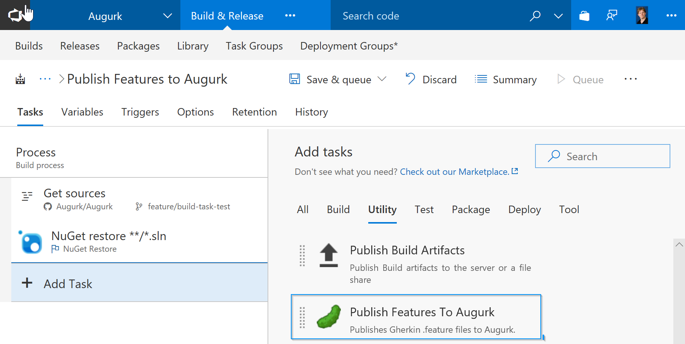
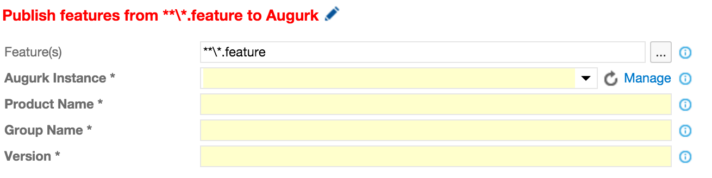

#Augurk Build Tasks

Install this extension in order to integrate *Augurk* into your build pipeline. At the moment, a single build task is
provided that publishes your __*.feature__ files to an Augurk instance.

To get started, use the following steps.

##1. Install Augurk
Before you can integrate with Augurk you obviously have to install Augurk somewhere. Download the latest release of
Augurk from our [GitHub](https://github.com/marktaling/Augurk) page and install the WebDeploy package on a server that
is accessible from Visual Studio Team Services.

##2. Add the build task to your build definition
Edit an existing build definition or create a new one and add the *Publish features to Augurk* task to it. It can be found
under the Utility group:

Once added, a couple of parameters need to be filled in:

