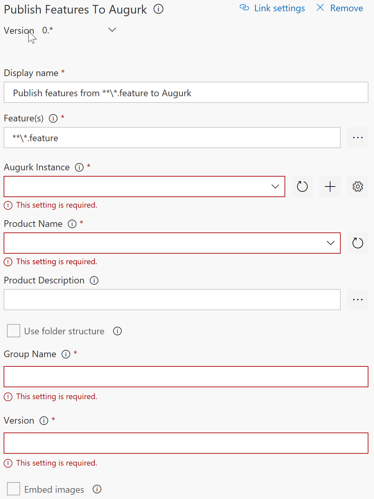

# Augurk

Install this extension in order to integrate *Augurk* into your build pipeline. At the moment, a single build task is provided that publishes your __*.feature__ files to an Augurk instance.

To get started, use the following steps.

## 1. Install Augurk
Before you can integrate with Augurk you obviously have to install Augurk somewhere. Download the latest release of
Augurk from our [GitHub](https://github.com/augurk/Augurk/releases) page and install the WebDeploy package on a server that can be accessed by your build agents. If you're using Visual Studio Team Services hosted build agents this means that your Augurk installation must be accessible on the public internet.

## 2. Add Augurk.CommandLine to your project
The actual publishing of feature files to Augurk is done through the Augurk.CommandLine tool. During the build this tool must be present in order to use the build task. The easiest way to accomplish this is to install the Augurk.CommandLine NuGet package into your project and ensure that NuGet packages are restored during the build. The build task will automatically pick this up.

Alternatively you can install the tool somewhere on your build agent and point the build task there through advanced configuration.

## 3. Add the build task to your build definition
Edit an existing build definition or create a new one and add the *Publish features to Augurk* task to it. It can be found under the Utility group:

## 4. Configure an Augurk connection
After adding the task to the build definition you should configure a connection to Augurk. This can be done by using the + button next to the Augurk Instance option in the build definition editor. This will open up a dialog where you can enter the URL on which your Augurk instance is available and any credentials you need to supply in order to access Augurk.

Once the connection has been established make sure it is selected as the Augurk instance to which features will be published.

## 5. Setup publishing
Finally, you'll need to configure a couple of parameters that are necessary for successfully publishing features.

* **Feature(s)** - The set of feature files that need to be published. By default this is any .feature file in any directory.
* **Augurk Instance** - Connection (created above) to the Augurk instance that you want to publish the feature files to.
* **Product Name** - Name of the product under which the features files are to be published. You can select an existing product in Augurk, or enter the name of a new product.
* **Product Description** - Optionally specify the path to a Markdown file here that is published as the description for the previously selected product in Augurk.
* **Use folder structure** - Check this option if you want to use the existing folder structure as the names of groups within your Augurk.
* **Group Name** - If the **Use folder structure** option isn't checked, enter the name of the group that you want to publish these feature files under in Augurk.
* **Version** - Version number of the feature files being published. Ideally a build variable is used here so that the version matches the version of the build. Can also be left blank if you only want to see the latest published version of features in Augurk.
* **Embed images** - When checked images that are referenced in feature files (using Markdown syntax) are embedded and published together to Augurk so that they are visible there.

## Advanced settings
To further customize how feature files are published to Augurk you can use the following advanced settings:

* **Use integrated security** - When checked the command line tool will use integrated security when communicating with Augurk. This can be useful in on-premises scenario's where you want to limit who can publish feature files to Augurk.
* **Language** - A .NET compatible culture name that is used to parse the feature files. Defaults to *en-US*. This is useful if you have your feature files written in another language but don't want to specify this language in every feature file.
* **augurk.exe Location** - Specifies the path to augurk.exe to use when publishing feature files. Defaults to a path that finds an augurk.exe in the packages folder.
* **Additional argument(s)** - Specify any additional arguments that you want to pass to augurk.exe here. Refer to the documentation (augurk.exe -?) to see the available options.
* **Treat warning(s) as errors** - Check this option if you want
warning(s) that are encountered during publishing should result in the build failing.